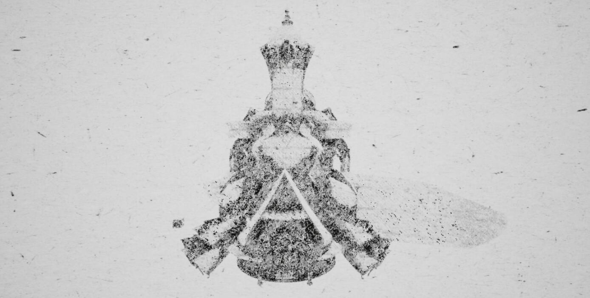
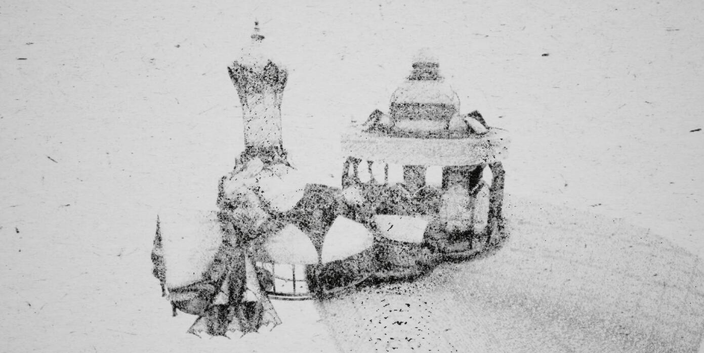
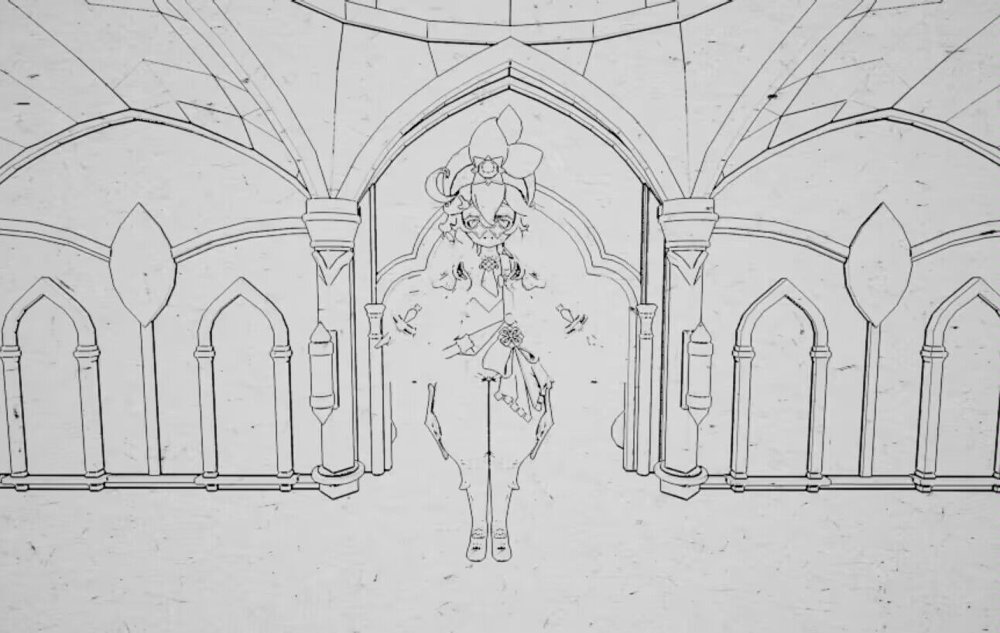
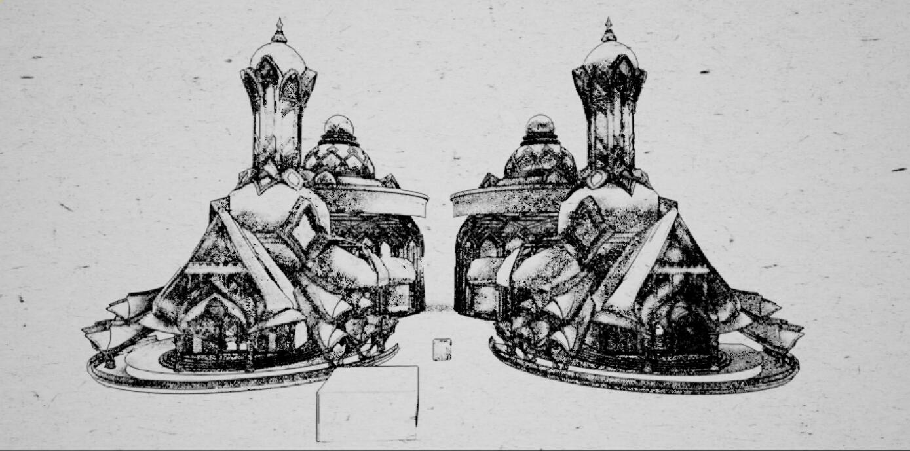
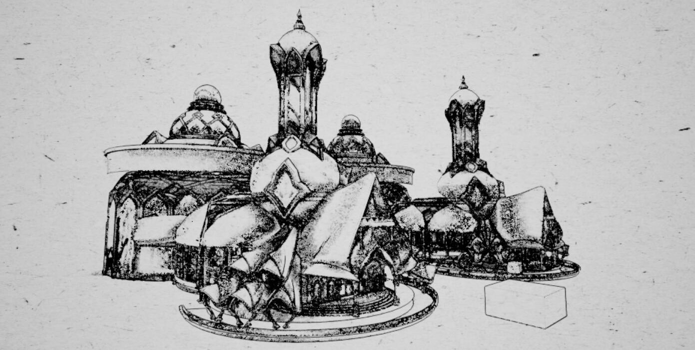
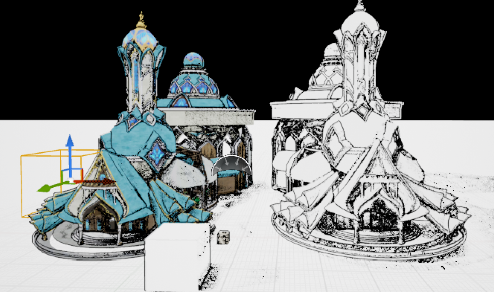

# Test Hatching Shader In Uneal Engine 5

## Demo (Bad texture, so not pretty)

### Without Outline

### Outline (DBuffer & WorldNormal)

### With Outline

### With Texture

## References

- [Hatching shader tutorial](https://www.youtube.com/watch?v=18U50KPdD2A)
- [Stylized lines and outlines - Unreal Material](https://www.youtube.com/watch?v=pJ42ylVyDpc)
- [Mix hatching with textures - Unreal material](https://www.youtube.com/watch?v=_V7DFLe11sI)